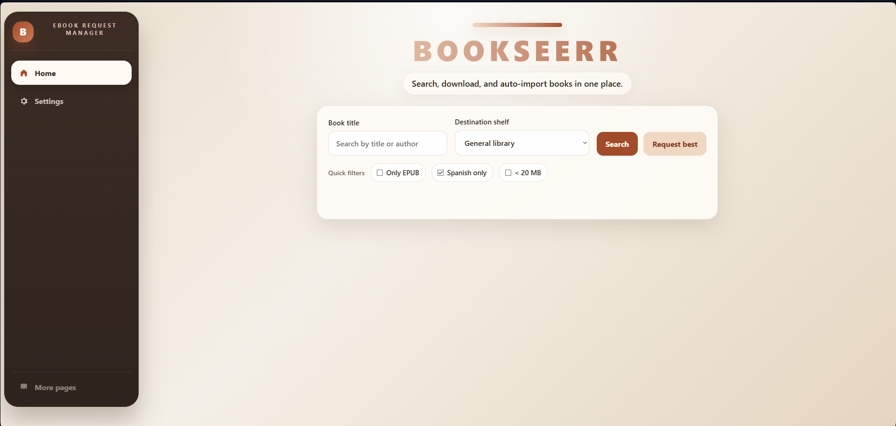
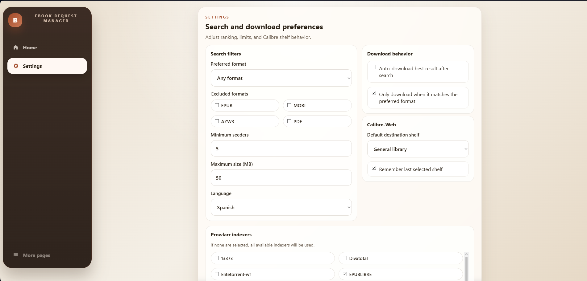

# Bookseerr – Ebook Request Manager for Calibre-Web

> A Jellyseerr-like app for searching, downloading, and importing ebooks into Calibre-Web.

Bookseerr is a self-hosted app that connects `Prowlarr`, `qBittorrent`, and `Calibre-Web` behind a modern React UI and an Express API. It helps you search for books, download the best match, and automatically import completed files into your library.

## Preview




## Highlights

- React frontend built with `Vite`
- Search view with rich result cards, covers, and quick filters
- Recent searches persisted locally for quick re-triggering
- Recent job activity with retry and re-download actions
- Full settings UI for ranking, download, and Calibre-Web behavior
- Automatic import pipeline from completed downloads into Calibre-Web
- Optional destination shelf selection and last-shelf memory

## Stack

- `frontend/`: React 19 + Vite
- `src/`: Express API, services, watcher, import pipeline
- `locales/`: UI translations
- `Dockerfile`: multi-stage build for frontend + backend

## How it works

Bookseerr integrates:

- `Prowlarr` for ebook search
- `qBittorrent` for download management
- `Calibre-Web` for library import and shelf assignment
- A local watcher that detects finished downloads and starts the import flow

Typical flow:

`Open UI → search book → start download/request best → watcher detects file → Calibre-Web import`

## Current frontend

The old vanilla frontend has been replaced by a React application. In production, Express serves the built app from `frontend/dist`. During development, Vite can run separately and proxy API requests to the backend.

Current UI features include:

- Search input with keyboard submit
- Quick filters such as EPUB-only, Spanish-only, and `< 20 MB`
- Recent searches shown under the search field
- One-click re-run of a recent search
- Clear recent search history
- Recent job activity with retry for failed jobs and re-download for completed ones
- Destination shelf selector when configured
- Full settings page for search and download preferences
- Result cards with cover, metadata, and direct download actions

Recent searches are stored in the browser with `localStorage`, so they persist across reloads on the same device.

## Project structure

```text
bookseerr/
├── frontend/
│   ├── src/
│   │   ├── components/
│   │   ├── hooks/
│   │   ├── lib/
│   │   ├── App.jsx
│   │   ├── main.jsx
│   │   └── styles.css
│   └── vite.config.cjs
├── locales/
│   ├── en/
│   └── es-ES/
├── src/
│   ├── config/
│   ├── lib/
│   ├── middleware/
│   ├── repositories/
│   ├── routes/
│   ├── services/
│   ├── utils/
│   ├── app.js
│   └── server.js
├── Dockerfile
├── docker-compose.example.yml
├── package.json
└── README.md
```

## Requirements

- Node.js `>= 18`
- Access to `Prowlarr`
- Access to `qBittorrent`
- Access to `Calibre-Web`
- A shared downloads directory visible to both Bookseerr and qBittorrent

## Quick start

### 1. Install dependencies

```bash
npm install
```

### 2. Create the environment file

```bash
cp .env.example .env
```

### 3. Configure your services

Edit `.env` with your URLs, credentials, folders, and optional shelf settings.

### 4. Run the backend

```bash
npm run dev
```

This starts the Express server on `http://localhost:3000`.

### 5. Run the React frontend in development

In a second terminal:

```bash
npm run dev:web
```

This starts Vite on `http://localhost:5173` and proxies `/api`, `/locales`, and `/health` to the backend.

### 6. Production build

```bash
npm run build
npm start
```

In production, Express serves the built frontend from `frontend/dist`.

## Available scripts

```bash
npm run dev       # Express API with nodemon
npm run dev:api   # same as dev
npm run dev:web   # Vite React frontend
npm run build     # production frontend build
npm start         # production server
```

## Environment variables

```env
PORT=3000
LOG_LEVEL=info

PROWLARR_BASE_URL=http://prowlarr:9696
PROWLARR_API_KEY=your_prowlarr_api_key

QBITTORRENT_BASE_URL=http://qbittorrent:8080
QBITTORRENT_USERNAME=admin
QBITTORRENT_PASSWORD=your_password
QBITTORRENT_CATEGORY=books
QBITTORRENT_SAVE_PATH=/downloads

CALIBRE_WEB_BASE_URL=http://calibre-web:8083
CALIBRE_WEB_USERNAME=admin
CALIBRE_WEB_PASSWORD=your_password
CALIBRE_WEB_LOGIN_PATH=/login
CALIBRE_WEB_UPLOAD_PAGE=/

FEATURE_DESTINATION_SHELF=false
DESTINATION_SHELVES=[]

DOWNLOADS_DIR=/downloads
LIBRARY_DIR=/library
STATE_FILE=/data/state.json
WATCHER_ENABLED=true
WATCH_EXTENSIONS=.epub,.mobi,.azw3
WATCH_DEBOUNCE_MS=8000

POST_IMPORT_ACTION=move
PROCESSED_DIR=/downloads/.imported

REQUEST_TIMEOUT_MS=30000
```

Example `DESTINATION_SHELVES` value:

```env
FEATURE_DESTINATION_SHELF=true
DESTINATION_SHELVES=[{"id":"maria","label":"Maria","qbSavePath":"/downloads/maria","calibreShelf":"Maria","calibreShelfId":1},{"id":"infantil","label":"Infantil","qbSavePath":"/downloads/infantil","calibreShelf":"Infantil","calibreShelfId":2}]
```

When destination shelves are enabled, the frontend shows an `Estantería de destino` selector and the chosen option is used to:

- keep the qBittorrent category unchanged
- optionally save the book into a destination-specific download folder
- preserve that destination in job tracking
- use a fixed `calibreShelfId` when available for deterministic shelf assignment
- upload the book to Calibre-Web and assign the configured shelf afterwards

Notes:

- `calibreShelfId` is the most reliable option if you already know the shelf IDs in Calibre-Web.
- `qbSavePath` may differ from `DOWNLOADS_DIR` as long as both point to the same mounted folder from the perspective of qBittorrent and Bookseerr.
- If you use custom `qbSavePath` values such as `/downloads/maria`, create those folders in advance and make sure they are writable.

## qBittorrent configuration

To allow Bookseerr to communicate correctly with the qBittorrent WebUI API, disable these options in:

`qBittorrent → Settings → Web UI → Security`

- Disable CSRF protection
- Disable Host header validation

If these stay enabled, requests may fail with `403 Forbidden` or authentication may fail silently when running behind Docker or reverse proxies.

## API

### `GET /health`

Returns service status.

### `GET /api/search?query=<text>`

Searches ebooks using Prowlarr and the currently active search settings.

```bash
curl "http://localhost:3000/api/search?query=dune"
```

### `POST /api/download`

Starts a manual download.

```bash
curl -X POST "http://localhost:3000/api/download" \
  -H "Content-Type: application/json" \
  -d '{
    "title": "Dune",
    "downloadUrl": "magnet:?xt=urn:btih:...",
    "protocol": "torrent"
  }'
```

### `POST /api/request`

Searches and starts the best available result automatically.

```bash
curl -X POST "http://localhost:3000/api/request" \
  -H "Content-Type: application/json" \
  -d '{
    "query": "Dune"
  }'
```

### `GET /api/settings`

Returns frontend settings, feature flags, destination shelves, and available indexers.

### `POST /api/settings`

Persists frontend-managed settings.

The settings payload accepts a new optional field to control indexer prioritization:

```json
{
  "filters": {
    "preferredFormat": "epub",
    "indexers": ["Indexer A", "Indexer B"],
    "indexerPriority": ["Indexer B", "Indexer A"]
  }
}
```

`filters.indexerPriority` is an ordered array of indexer names (strings). When present, Bookseerr will give a bonus to search results that originate from earlier indexers in the list.

### Scoring & Indexer priority

Bookseerr now uses a scoring-based ranking for search results to provide more consistent and relevant "best" selections. Factors included in the score:

- Preferred format: large bonus when the result matches `filters.preferredFormat`.
- Format bias: EPUB/azw3/mobi receive positive weight; PDF receives a negative penalty by default.
- Seeders: added as points (capped) so healthier torrents rank higher.
- File size: smaller files are preferred with a small bonus (to avoid unnecessarily large downloads).
- Language match: bonus when the result language matches `filters.language`.
- Indexer priority: optional ordered bonus via `filters.indexerPriority` (earlier indexers get a larger bonus).

The `/api/search` response includes a numeric `score` on each result so you can inspect why a result was chosen. The search pipeline still applies filters (excluded formats, min seeds, max size, indexer selection) and falls back through relaxed stages if no result matches strictly.

### How to test locally

1. Open the UI and go to Settings → Prowlarr indexers. Use the new "Indexer priority" panel to add and order indexers.
2. Save settings (this issues `POST /api/settings`).
3. Run a search and inspect the returned results with `curl`:

```bash
curl "http://localhost:3000/api/search?query=your+book" | jq .
```

Look at the `score`, `format`, `seeders`, `sizeMB`, and `indexer` fields to verify ranking behaviour. Adjust `indexerPriority` or format preferences and save again to retune.

Example `POST /api/settings` body including priority (useful for testing via `curl`):

```bash
curl -X POST http://localhost:3000/api/settings \
  -H "Content-Type: application/json" \
  -d '{"filters":{"preferredFormat":"epub","indexers":["MyIdx"],"indexerPriority":["MyIdx"]}}'
```

This feature is intended to make "best result" selection more deterministic and customizable for multi-indexer setups. If you want different weighting (e.g., reduce format bias or change size/seed influence), we can expose weight settings in the UI or tune defaults in `src/services/prowlarr.service.js`.

### `GET /api/jobs`

Returns tracked jobs.

### `POST /api/jobs/:jobId/retry`

Creates a new download job using the stored data from a failed or completed tracked job.

## Automation flow

1. The user searches for a book or requests the best match.
2. Prowlarr returns ranked results using the active filters and preferences.
3. qBittorrent starts the selected download.
4. The watcher detects completed files in the downloads folder.
5. The import service uploads the book to Calibre-Web.
6. The file is moved or deleted based on `POST_IMPORT_ACTION`.

## Docker

### Build locally

```bash
docker build -t bookseerr .
```

### Run container

```bash
docker run -d \
  -p 3000:3000 \
  --env-file .env \
  -v /your/downloads:/downloads \
  -v /your/library:/library \
  -v /your/data:/data \
  --name bookseerr \
  bookseerr
```

### docker-compose

A `docker-compose.example.yml` is included.

Typical steps:

1. Copy it to `docker-compose.yml`
2. Update the build path if needed
3. Adjust volumes and `.env`
4. Run `docker compose up -d --build`

## Notes

- `/downloads` must match the path visible to qBittorrent
- `/library` must match the Calibre-Web library path
- `/data` should be persisted to keep state and settings
- Check filesystem permissions carefully, especially on NAS setups

## Roadmap

- [x] Automatic destination shelves
- [x] React frontend migration
- [x] Configurable settings UI
- [x] Recent searches and quick re-run
- [ ] Favorites / watchlist system
- [ ] Enhanced job tracking and activity view
- [ ] Notifications for download and import status
- [ ] Better Calibre-Web workflows and shelf tooling
- [ ] Optional discovery and metadata features

## License

MIT License © 2026 Cruzadera
